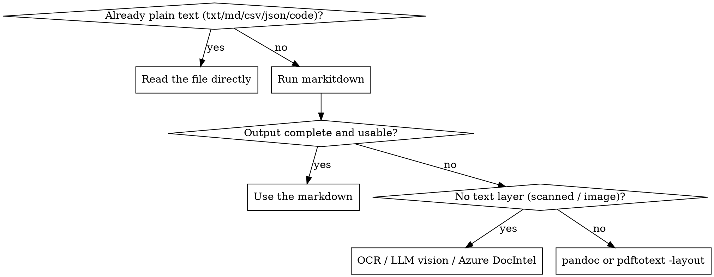

# markitdown

## Overview
`markitdown` (Microsoft) converts many formats to Markdown tuned for LLM consumption — it keeps structure (headings, tables, lists, links) instead of dumping raw text.

**Core principle:** for any document you cannot `Read` directly, try `markitdown` first. If the output is empty, garbled, or loses structure you need, fall back to a more specialized tool — do not force markitdown.

## When to use
- Office/binary docs: `.pdf .docx .pptx .xlsx .xls .epub .msg`
- Media needing text: images (OCR + EXIF), audio (transcription)
- Web/markup: HTML, a YouTube URL (transcript)
- Bundles: `.zip` (converts each entry)

**When NOT to use:**
- Already-text files (`.md .txt .csv .json .xml .yaml`, source code) → use `Read`; markitdown adds nothing.
- You need byte-perfect layout fidelity → a specialized parser is better.

## Decision: markitdown vs fallback


## Quick reference
| Goal | Command |
|------|---------|
| Convert to stdout | `markitdown file.pdf` |
| Save to a file | `markitdown file.pdf -o out.md` |
| From stdin (hint type) | `cat file \| markitdown -x pdf` |
| Keep base64 images | `markitdown f.docx --keep-data-uris` |
| Scanned PDF via Azure | `markitdown f.pdf -d -e <endpoint>` |
| List installed plugins | `markitdown --list-plugins` |

Run `markitdown --help` for all flags. Advanced usage (Python API, LLM image captions, Azure Document Intelligence, plugins) → see `reference.md`.

## Verify / install
Format support comes from optional extras. If `markitdown` is missing or a conversion errors with a missing-dependency message, install with all extras:
```bash
command -v markitdown || uv tool install 'markitdown[all]'   # or: pipx install 'markitdown[all]'  /  pip install 'markitdown[all]'
```

## Fallback strategy
If the output is poor, switch tool to fit the failure:
| Situation | Use instead |
|-----------|-------------|
| File is already plain text | `Read` the file directly |
| `.docx/.epub/.rst/.tex`, structure matters | `pandoc in.docx -t gfm -o out.md` (`brew install pandoc`) |
| PDF with a real text layer, layout matters | `pdftotext -layout in.pdf -` (`brew install poppler`) |
| Scanned PDF / image, no text layer | OCR, LLM vision (`Read` the image), or Azure Document Intelligence (`-d -e`) |

## Common mistakes
- Running markitdown on plain text / CSV / JSON — wasteful; just `Read`.
- Treating empty output as success — a scanned PDF yields little. Check the result, then fall back to OCR/vision.
- Omitting `-x/--extension` when piping via stdin — no filename means no format detection.
- Expecting perfect tables from complex PDFs — verify; fall back to `pdftotext -layout` if a table is mangled.
